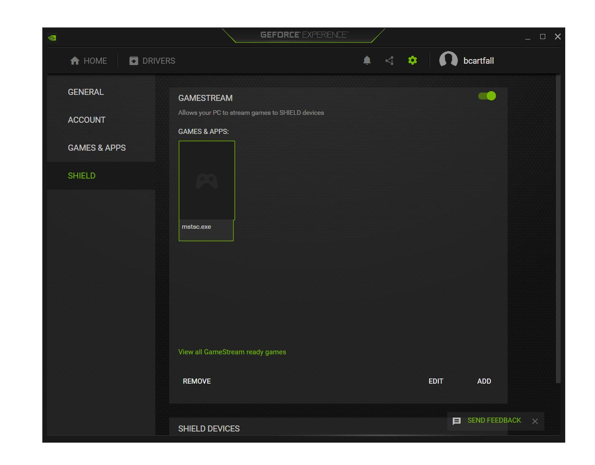

# NVidia Game Stream Autohotkey Automations

Use these scripts to start or stop NVIDIA GameStream without manual interaction. It works by checking if GameStream is running by checking for an open port. Then it opens the GeForce Experience application and reads the color of pixels to determine which UI elements to click on to enable or disable GameStream.

# Use Cases

- Rolling out a new server.
- Disabling NVIDIA GameStream so that your family can't watch your desktop while your working.

# Instructions

Download AutoHotKey https://www.autohotkey.com/ and run scripts. Since the script simulates mouse clicking do not use your keyboard or mouse while the scripts are running.

# Preview

# Licence

MIT. 

If you find these scripts useful please let me know.